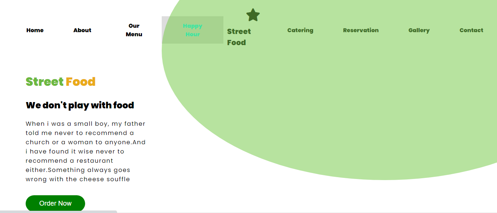
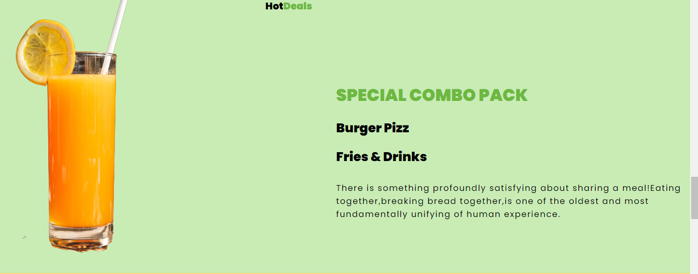
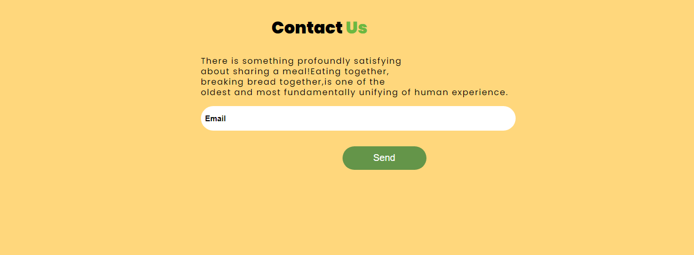

# Street Food Website
Welcome to the Street Food Website!Basically the website contains several sections such as reservations,happy hour and also enables people to order their favorite meals through their phones or computers.
## Tools
The website is developed using:
1. HTML5
2. CSS3
## Prequisites
1. A terminal for those on Linux or MacOS and Gitbash for those on windows.
2. Visual Studio code or any editor where the code will be displayed.
## Set up
Follow these instructions for easy accessibility of the project;
1. Clone this repository to your local machine :
```
https://github.com/Issa783/Street-Food-website-.git

```
2. Navigate to the project directory
```
cd Street-Food 
```
## Screenshots
A selection of some of the section images






## Author
The website is developed by ;

[John Mutua](https://github.com/Issa783)
## License
The project is licensed under the [MIT License](https://choosealicense.com/licenses/mit/)
